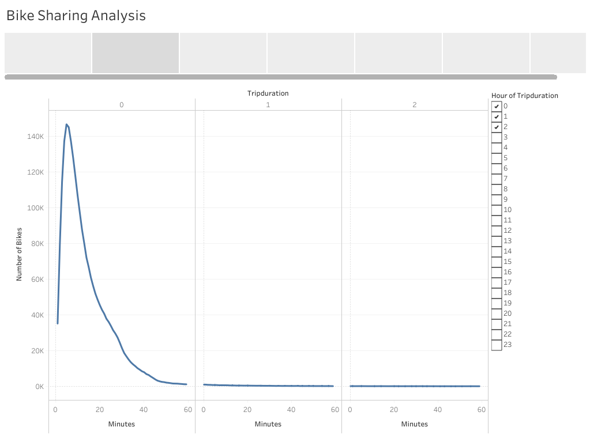
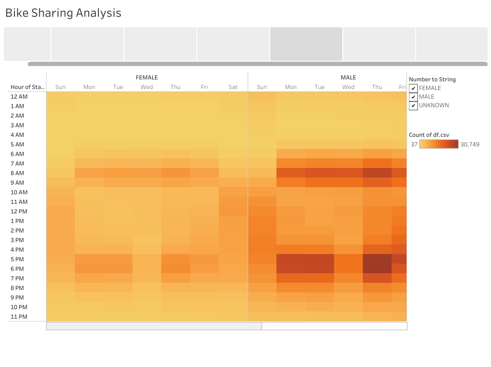

# Bike Sharing Tableau Analysis 

## Overview of the Statistical Analysis

### Purpose
Our purpose for this analysis stems from the potential business opportunity of bringing a bike sharing service to our home city of Des Moines, Iowa. After enjoying sightseeing in New York City and easily traveling throughout the city using Citibike, we had the idea of starting up the service in our hometown. A potential angel investor is interested in the business idea as well which lead to our analysis on New York City bike sharing data to gain a thorough understanding on how this business operates. With this information we can build a model for how the business would work in Des Moines. We decided to utilize Tableau to visualize the bike sharing data and help convince investors that a bike sharing program in Des Moines is a solid business proposal. 

## Bike Sharing Results

### Analysis Visualizations

This map displays the top starting locations within New York City for bike sharing users. Each location point shows its usage rate by the size and color of the mark, with a larger and deeper shade of blue indicating a higher rate. 

This graph displays the bike checkout time across all users. Its measured by their trip duration for each time that a bike was rented. 

This graph is similar to the previous one but is segmented to display the checkout time across genders. 

This heatmap shows a breakdown of the highest hours bikes were rented broken down by each day. The darker the shade indicates a higher rate of bikes being rented. 

This heatmap is similar to the previous one but is segmented to display the highest hours bikes were rented across genders. 

This bar graph shows which bikes were used the highest amount during the month which the data was collected. These would more likely need repairs than other bikes that aren't used as often. 

This heatmap shows the type of user renting the bike, if they are a customer or subscriber and is further segmented by gender along with the weekdays. A darker shade indicates a higher rate of bikes being rented. 

## Bike Sharing Summary

### Analysis Takeaways & Further Research 

From our analysis we can conclude that there are certain areas within New York City that receive higher usage rates where users go to find available bikes to rent, compared to lesser utilized locations. This can also be determined from the bike repairs graph that shows the count of usages on each specific bike id, and this information can also be used to plan ahead for which bikes will need repairs more frequently. Bike repairs can be planned around the prime hours of usage rates by users, which were found to be after working hours 5-7pm Monday through Friday and also before the work day between 7-9am. When adding genders to this review it was found that males had the higher usage rate among bike sharing users. When the focus is turned to the user type, subscribers utilized bike sharing more then customers across both genders, and by far the largest subset user portion was male subscribers. When reviewing the trip duration across all genders, majority of trips were completed under 20 minutes and they did not exceed one hour.

For further research, one potential visualization can be to include the user type segment on the trip duration chart to determine if there is a difference on the type of trips that regular customers are using the bike sharing option compared to subscribers. Another potential option can be adding the user type segment to the trips by hour heatmap to determine if there are certain times of the day that each type of user is choosing to utilize bike sharing more frequent than the other. 

[link to dashboard](https://public.tableau.com/app/profile/jack.petrella/viz/BikeSharingAnalysis_16523072014390/BikeSharingAnalysis?publish=yes)

